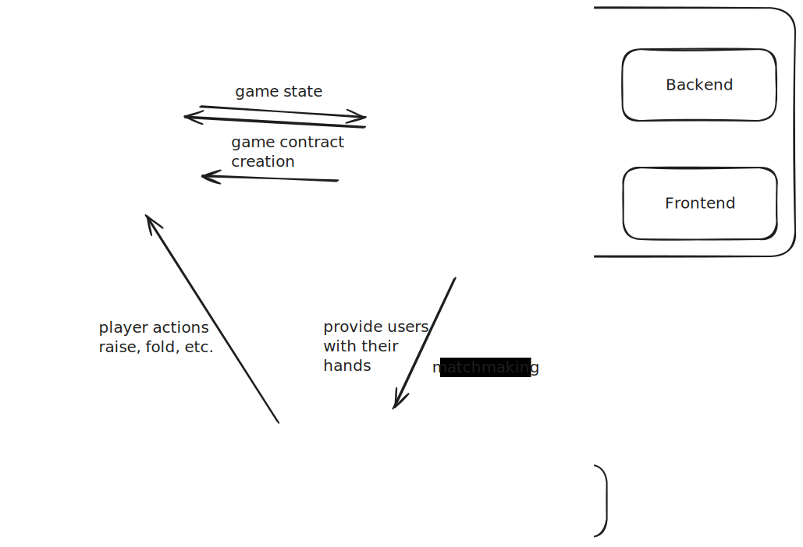

# Technical test - blockchain developer position

Alex Langevin  
alexlangev@gmail.com  
514 435-9674

## Assignment given

```
Here is the assignment we came up with. Max 2 hours, you can talk about how you would approach this and deliver incomplete code, we want to know your thought process above all:

Write a Solidity smart contract that enables 2 players to play a game of texas holdem, all actions in the game are messages in the contract, for committing cards and funds there is a 3rd wallet that will commit the messages to end the game and validate actions between the players.

In the end the game must distribute rakes to the winner, winner is sent to the contract via the 3rd wallet.
```

## Deliverables expected:

-   Important code snippets
-   Architecture overview
-   Any relevant documentation

## Disclaimer

I am not very familiar with the rules of poker. I might have missed some rules or implemented some logical bugs because of it.

## Architecture

There are multiple ways to build a viable blockchain based poker game. The more of the game's logic is put on-chain, the more decentralized it will be. That being said, it comes at the cost of speed, higher fees and having to mask the ongoing game state since all data stored on-chain is public.

I will assume that the architecture follows a hybrid approach. Some of the game's logic is handled by a smart contract while some other logic like the matchmaking, the shuffling and distribution of the cards and the winner declaration will be handled by a traditional web2 stack.

For the sake of simplicity, I will assume that the game is played on a web app with ETH only. Of course, allowing users to play with different tokens and possibly swap between chains would be a great feature.



### Components

-   **Player's wallets**: The user connects with an EOA. Adding the option of using metamask could be good here. The wallet allows users to interact with the protocol.
-   **Dealer's wallet**: This is the _third wallet_ mentioned in the assignment. This is how the logic coming from the backend interacts with the game contract.
-   **Game contract**: A smart contract that defines and enacts the _game rules_. In addition to the Texas Holdem rules, this is where important parameters are handled. For instance, player's addresses, the entrance fee, the reward distribution scheme, the time allocated for each round etc. Additionally, the contract holds the funds until the game is over.
-   **Frontend**: The web app client itself. It provides the users a nice and engaging GUI.
-   **Backend**: Most likely a server that handles all of the state that needs to stay secret. For instance, what cards are in each player's hands. It also handles the _randomness_ logic. I could use a standard random-number-generator or a more decentralized solution like Chainlink VRFs.

### Additional ideas

-   Implementing an ERC20 token that acts as chips in a casino could be an improvement in UX. Bidding small fractions of an ETH can be hard to grasp. Dealing with chips pegged to an Eth value could make it a better experience. Additionally, the protocol could encourage users to keep their Eth in chips by implementing some form of staking.
-   To improve on the decentralization, the frontend could be hosted on IPFS. The same idea could be applied to the database with IPFS or Filecoin. These are great but might be more expensive and are known to be slower.
-   Chainlink VRF is a great source of on chain randomness which helps to make the protocol more trustless.
-   Historical data could be stored in a standard SQL database. This would make the UI faster than having to read on-chain data each time.
-   The app could provide users with a dashboard displaying their game statistics.

### Security considerations

-   Storing the players hands on chain unencrypted is not an option since all data stored on-chain is public. [source](https://github.com/x676f64/secureum-mind_map/blob/master/content/4.%20Pitfalls%20and%20Best%20Practices%20101/Private%20on-chain%20data.md)

-   Choosing the source of randomness is crucial:

    -   Using `block.timestamp` or `blockhash` is not a secure source of randomness [source](https://github.com/x676f64/secureum-mind_map/blob/master/content/4.%20Pitfalls%20and%20Best%20Practices%20101/Weak%20PRNG.md)
    -   Using Chainlink VRF as source of randomness might be a security risk since The proof is published and verified on-chain before any consuming applications can use it. This would need to be investigated [source](https://docs.chain.link/vrf)

    -   Handling the randomness logic on the backend is most likely the best option. That being said, it centralizes the protocol. A threat actor gaining access to the system or a compromised employee could in theory modify the odds for certain players. Proper operational security is mandatory with the web2 part of the stack. Following the **Rekt test** is always a good idea. [source](https://blog.trailofbits.com/2023/08/14/can-you-pass-the-rekt-test/)
